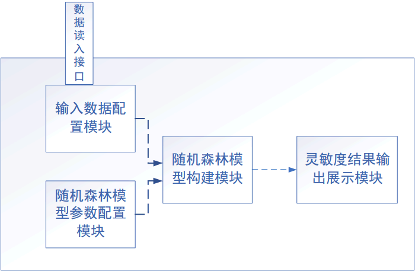

---
fignos-cleveref: On
fignos-plus-name: 图
fignos-caption-name: 图
...

针对指标灵敏度、网络要素的体系贡献率、系统的体系贡献率等方面开展国内外技术发展与应用分析，提出天基信息网络指标体系贡献率模型。模型应结合现有评估系统设计实现，具有较低的时间复杂度；能够依据效能评估结果对指标的贡献程度做出判断，反映指标在该次评估结果中的影响程度；支持对同一场景中不同系统参数或不同评估算法下的指标贡献率分析，算法参数可配置。
2）实现指标体系贡献率计算结果的展示，通过图表方式直观反映各指标的贡献率排序，并能够通过评估结果对比，体现指标体系贡献率分析的优化指导作用。

## 灵敏度分析

灵敏度分析在很多领域中又叫重要性分析，是复杂系统不确定性分析问题中的一个重要方面，旨在研究复杂系统输出性能不确定性向各个输入变量分配的问题，进而识别出影响复杂系统输出性能的主、次输入变量，为系统的可靠性设计和评估模型的简化提供丰富的信息。随着计算机计算能力的飞速发展，越来越多复杂的工程系统可以借助计算模型来进行分析。同时在各个科研领域中复杂计算辅助模型也有广泛应用，灵敏度分析以及在工程应用方面的研究已成为了众多学科的研究热点。

灵敏度分析技术可以从输入变量的整个分布范围来定量的衡量输入变量的不确定性对工程设计中所感兴趣的输出量的贡献程度。对于一个输出响应函数形式为${Y = g(X_1,X_2,...,X_n)}$的结构系统，全局灵敏度分析可将基本输入变量$X$的不确定性与输出响应量$Y$的不确定性联系起来。它可以指出各基本输入变量的不确定性对响应量影响程度的大小，继而可以依次确定它们的实验或研究的优先级别，即确定模型输入变量的重要性次序，甚至还可以帮助更好地定义未知参数，以最终减少响应的不确定性范围，直到获得要求的响应性能的不确定性范围，也就为有针对性地改善结构模型提供了一种可行的新途径。因而对不确定变量的灵敏度的研究近年来成为了工程研究领域中一个新的重要方向。同时，在天基信息网络中，由于某些参数内在的不确定性或者运行环境的随机性使得天基信息网络系统中存在着各种不确定性。关于系统不确定性分析问题可以通过灵敏度分析的方法进行研究。灵敏度分析主要解决的问题是如何有效甄别各输入变量的不确定性对系统性能响应量的影响，从而提供网络系统性能设计所需要的重要信息，对提高网络运行质量和可靠性、简化分析模型以及减小管理决策失误率都具有重要意义。

另外，随机森林是近年在生物学领域的研究热点，从学科交叉的角度考虑，可以将其引入到天基信息网络评估分析中。通过建立一组随机决策树（回归树或分类树，取决于具体问题）组成随机森林，然后根据每棵树的预测结果进行投票得到最终预测结果，是一类特别适用于高维小样本问题的分析方法，并且对非线性和交叉作用显著的问题也适用。该算法通过统计学习可以自动识别出对输出影响较小的输入变量，因而具有灵敏度分析功能。目前，该方法只在数据挖掘和生物信息学领域得到广泛应用，所以将其引入到天基信息网络综合评估中，具有一定的实用性和创新性。

## 随机森林

随机森林算法最初由 Breiman 提出，是一种应用于生物信息学中的机器学习算法，近些年也在诸如航空安全和健康监控等领域得到广泛关注。随机森林由一系列的决策树组成，而这些树是通过递归分裂法则（如分类和回归树法则）建立起来的。作为一种非参数回归和分类的机器学习方法，随机森林对低维和高维数据分析均适用，特别是针对输入变量的维度大于数据规模的问题以及“黑盒”问题。当用于分类问题时，随机森林可看做由树结构分类器的集合构成的分类器，给定一个输入向量值，每个决策树都会预测出一个投票。单个决策树对于输入的小扰动较为敏感，但是随机森林能够有效克服这一缺点，因而具有更加稳健的分析结果。随机森林算法还可用于衡量输入变量的相对重要性，也即可以用于全局灵敏度分析。其重要性指标包括 Gini 重要性指标(GVIM)、扰动重要性指标(PVIM)、条件扰重要性指标(CPVIM)。在天基信息网性能评估分析中使用应用最广泛的扰动重要性指标。

## 随机森林模型的建立

复杂系统用确定型模型$Y = g(X)$来表示，其中$Y$是输出变量,$X = (X_1,X_2,...X_n)$是$n$维相互独立的随机输入变量。用$T = (x_i, y_i)(i = 1,..,N)$表示用于建立随机森林的训练样本集,其中$N$表示训练样本的规模。从总训练样本$T$中重复抽样组成一系列样本集合$T_k = (x_{j}^{(k)},y_{j}^{(k)}) (j = 1, ... ,N_k, k = 1,...,n_{tree})$，第$k$个样本集合用于建立第$k$个决策树,$N_k$ 表示$T_k$的样本规模,$n_{tree}$表示需要建立的总决策树的个数。建立随机森林的过程简要总结如下:

I.  通过实验或抽样的方法得到一组样本规模为$N$的训练样本$T$。
 
II. 随机的（替换或非替换的方法）从样本集$T$中选取$N_k$个训练样本组成新的规模为$N_k$的训练样本$T_k(k = 1, ... n_{tree})$,Breiman 在文献中推荐取$N_k = 0.623N$.

III.  用CART 法则建立第$k$个决策树。CART 法则事实上是一种二元递归分裂法则,它将输入变量的空间分割成越来越多的同类别的小矩形区域，所建立的决策树根节点包含了所有
$N_k$个训练样本集，在每一个分裂节点（包括根节点）有如下分裂准则： 

a. 从输入变量$X$中随机选取$m_{try}$个变量作为候选分裂变量。Breiman 建议，对于回归问题取$m_{try} = \frac{n}{3}$,对于分类问题$m_{try} = \sqrt{n}$.

b.分裂变量$X_s$和分裂阈值$x_{s}^{*}$的选取准则是使得节点不纯度的减小量$\Delta GI = GI_f - P_{r}GI_{r} - P_{l}GI_l$达到最大，其中$GI_f$表示父节点的 Gini 不纯度，$GI_l$和$GI_r$分别表示左右子节点的Gini不纯度,$P_r$和$P_l$分别表示父节落入左右子节点的概率。 

c.  将父节点中的数据分配到子节点中。$X_s$变量的值小于阈值$x_{s}^*$的样本分配到左子节点中，剩余的样本分配至右节点中。按此准则不断向下分裂，直到满足停止条件（如 Gini 不纯度指标低于某个给定值）。
 
d.  在叶子节点，模型输出值通常用该叶子节点内数据的平均值来确定。也就是说，每个叶子节点内的输出值是常数，因此决策树也可以看成是分段常值函
数。 

用以上步骤建立起随机森林后，就可以用其进行预测和重要性分析。给定一个新的输入向量值，输出量的预测值就是对$n_{tree}$个决策树的预测值的平均。

## 随机森林扰动重要性指标

由于第$k$个决策树是根据训练样本$T_k$建立的，将未被用于建该树的数据叫做袋外数（OOB）。袋外数据$B_k = T - T_k$可用于衡量第$k$个树的预测精度。

对于第$k$个树，其袋外数据为$B_k = (x_{l}^{(k)}, y_{l}^{(k)})(l = 1, ... ,N_{\bar{k}})$, 其中$N_{\bar{k}}) = N- N_k$表示第$k$个树的袋外数据，$y_{l}^{(k)}$是输入变量$x_{l}^{(k)}$的精确值。用$\hat{y}_{l}^{(k)}$表示第$k$个树的对$x_{l}^{(k)}$的估计值,则第$k$个树的均方误差表示为:$${MSE_k = \frac{1}{N_{\bar{k}}} \sum_{l=1}^{N_{\bar{k}}}(y_{l}^{(k)} - \hat{y}_{l}^{(k)})^2}$$ 将袋外数据$B_k$中的第$X_i$列的数值进行随机扰动，$\hat{y}_{l}^{(k)}(X_i)(l = 1, ... ,N_{\bar{k}})$表示随机扰动后的第$k$个树的预测结果,则扰动后的均方误差为:$${MSE_k(X_i) = \frac{1}{N_{\bar{k}}} \sum_{l=1}^{N_{\bar{k}}}(y_{l}^{(k)}- \hat{y}_{l}^{(k)}(X_i))^2 }$$ 变量$X_i$扰动后的均方误差相对于扰动前的均方误差为:$${VI_{i}^(k) = MSE_k(X_i) - MSE_k}$$ 扰动重要性指标定义为所有树的$VI_{i}^{(k)}$的平均:$${PVIM_i = \frac{1}{n_{tree}}\sum_{k=1}^{n_{tree}}VI_{i}^{(k)}}$$ 通过随机扰动$X_i$的值，其边缘分布没有发生变化，但是破坏了变量$X_i$和输出响应量$Y$的相关性，以及变量$X_i$与其所有其他输入变量之间的相关性。如果变量$X_i$越重要，那么扰动$X_i$后的均方误差增量就会越大，因此指标$PVIM_i$的值也越大。因此，$PVIM_i$包含了变量$X_i$的独立作用以及和所有其它变量的交互作用对输出性能的影响，从而可以用来进行变量筛选和变量重要性排序。

随机森林的复杂度，假定有$n$个样本，$m$个特征，训练的时间复杂度为$O(mn log(n))$.如果是用$M$个树来预测，时间复杂度为$O(M(mn log (n)))$.同时随机森林作为一种集成学习的组合模型，很容易做成多核并行处理的算法，所以其时间的复杂度可以通过并行处理进一步降低。

## 基于随机森林的天基信息网指标灵敏度分析

基于以上随机森林的构建过程和变量重要性得分的计算过程，因此将随机森林算法用于天基信息网指标灵敏度分析的过程如下：

1. 输入$n$个原始指标数据和对应的指标数据的效能评估值，为了能有更好的效果，样本量越多越好；
2. 以效能评估值为目标值，指标数据为输入变量，训练随机森林回归模型；
3. 通过训练得到的随机森林模型，输出个指标数据的重要性得分。

基于上述过程，则该算法的软件设计的框架如{@fig:rfmodel}所示：

{#fig:rfmodel}

其中输入数据配置模块，可配置目标输出值，和输入变量值，即能够选择不同的自变量和因变量；随机森林模型配置参数配置模块可配置随机森林的模型参数，如树的个树，树的深度，并行处理的进程数等参数；输出结果的展示模块，可以输出展示，一次或者多次的不同输入参数的一个或者多个的模型的灵敏度的分析结果。

